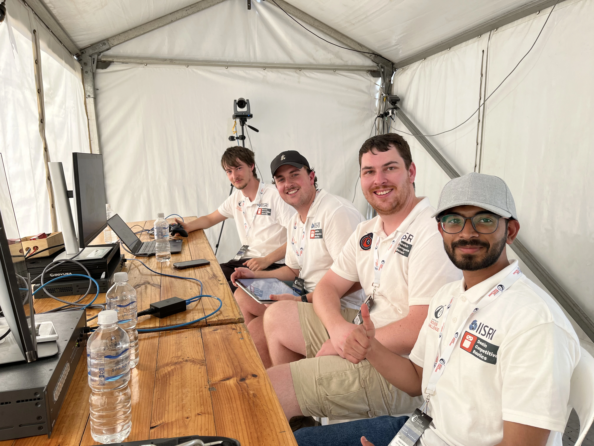
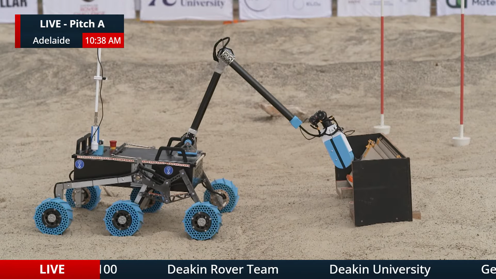
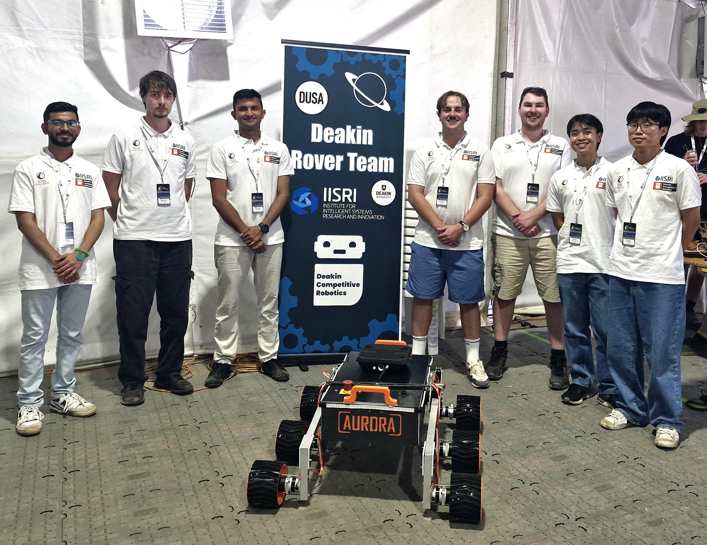
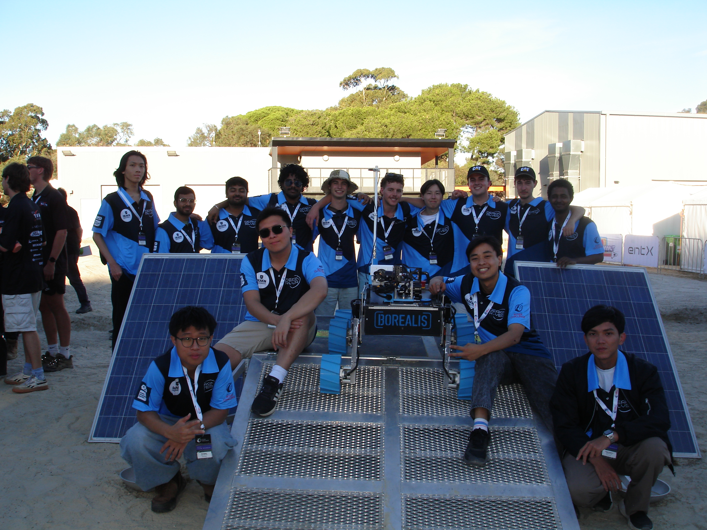
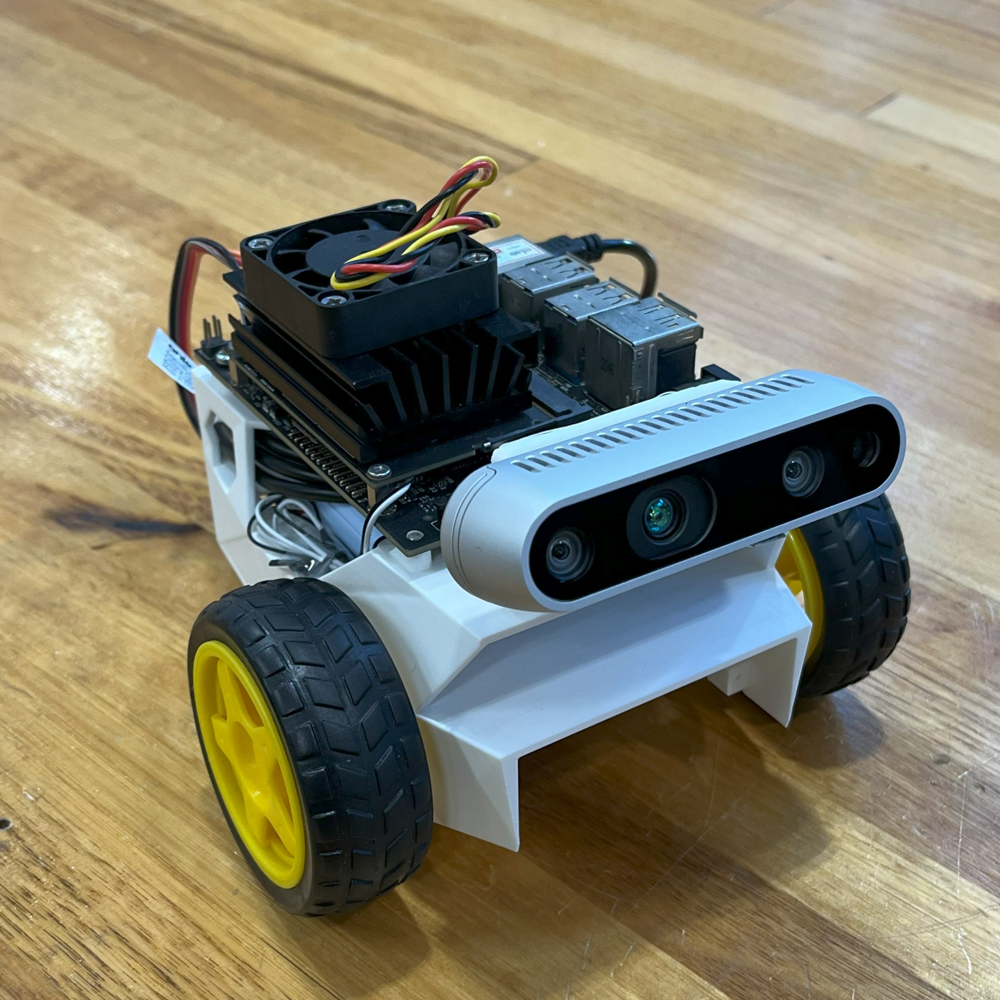

<h1 align="center">Hi, I'm Misbah 👋</h1>

  

---

### About me

- 🚀 Mechatronics & Control Engineer
- 🧠 Currently exploring **computer vision, SLAM, and embedded C/C++**
- 💬 Ask me about **robots, control systems, or over-engineering side projects**

---

### 🛰️ Deakin Rover — 2 years, 2 builds

<table>
  <tr>
    <td align="center"><strong>Rover 2025</strong></td>
    <td align="center"><strong>Rover 2026</strong></td>
  </tr>
  <tr>
    <td></td>
    <td></td>
  </tr>
  <tr>
    <td align="center"><strong>Team 2025</strong></td>
    <td align="center"><strong>Team 2026</strong></td>
  </tr>
  <tr>
    <td></td>
    <td></td>
  </tr>
</table>

---

### 🤖 JetBot — learning autonomy from the ground up

  

---

### 📌 Featured Projects

| Project | What it is |
| --- | --- |
| [**deakin_rover**](https://github.com/mirmisbahali/deakin_rover) | Lunar rover build: mechanical, electronics, and autonomy software |
| [**deakinrover.space**](https://github.com/mirmisbahali/deakinrover.space) | Public website for the Deakin Rover team |
| [**mirmisbahali.com**](https://github.com/mirmisbahali/mirmisbahali.com) | My personal site and portfolio |
| [**misbah-jetbot**](https://github.com/mirmisbahali/misbah-jetbot) | NVIDIA JetBot experiments — computer vision and autonomy |

---

### 🛠️ Tools I reach for

**Embedded & Robotics**

**AI & Data**

**Web & Tooling**

---

### 📊 GitHub stats

  
  

  

---

### 🌐 Connect

  
  

